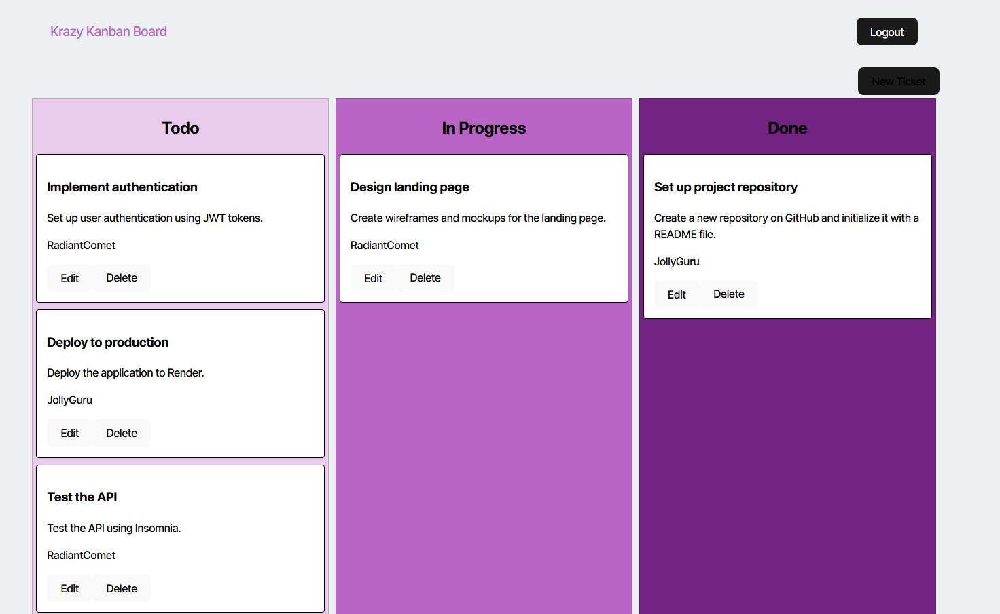

# Kanban Board Project

[Deployed Application](https://one4-kanbanboard.onrender.com/)

## Overview

This project is a Kanban board application that helps users manage tasks efficiently. It allows users to create, update, and delete tasks, as well as move them across different stages of the workflow.

## Features

- **Task Management**: Create, update, and delete tasks.
- **Drag and Drop**: Move tasks between different stages.
- **User Authentication**: Secure login and registration system.
- **Responsive Design**: Works on both desktop and mobile devices.

## Installation

1. Clone the repository:

    ```bash
    git clone https://github.com/yourusername/kanbanboard.git
    ```

2. Navigate to the project directory:

    ```bash
    cd kanbanboard
    ```

3. Install dependencies:

    ```bash
    npm install
    ```

4. Start the development server:

    ```bash
    npm start
    ```

## Usage

1. Open your browser and go to `http://localhost:3000`.
2. Register a new account or log in with an existing account.
3. Start managing your tasks by creating new ones and moving them across different stages.



## Contributing

Contributions are welcome! Please fork the repository and submit a pull request.

## License

This project is licensed under the MIT License.
